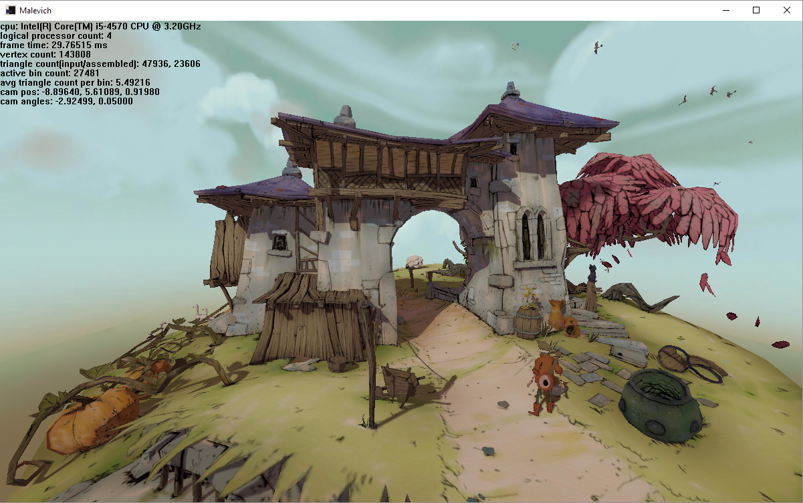

<!---->

# Malevich

This project is a study into the graphics pipeline, software rendering via rasterization and parallel programming (multithreading and SIMD) in C. I tried to mimic Direct3D 11 in both api and rendering capabilities but there are still some features missing. I plan to improve Malevich's capabilities to match WARP's in the future.

# Prerequisites

The project is set to build with the following configurations:
* Windows 10 SDK (10.0.17134.0)
* Visual Studio 2017 (v141)
* Intel Compiler 18.0 (x64)
* An Intel CPU that support AVX

# Build Instructions

The repository contains Visual Studio 2017 project files that are ready to build with Intel Compiler 18.0 on Windows 10. At the time of writing, Intel System Studio 2018 has a free commerical license in which you can download Intel Compiler 18.0 as a module. You also need to install Desktop development with C++ component of Visual Studio if you have not done before.

Only external dependency is [Remotery](https://github.com/Celtoys/Remotery) which is included in the project. You can use index.htlm under /vis to see the profiler in action.

# Executable

If you want to try Malevich without building, I added the runtime with an x64 executable into the /bin folder.

# Third Party Licences
* Libraries:
  * Remotery: Apache License 2.0
 * Assets:
    * [FTM](https://sketchfab.com/models/0970f30574d047b1976ba0aa6f2ef855) by [luyssport](https://sketchfab.com/luyssport) : CC BY-NC-SA 4.0
    * [Toon](https://sketchfab.com/models/3a33d33a6813410882f63d18c8189755) by  by [luyssport](https://sketchfab.com/luyssport) : CC BY-NC-SA 4.0
    * [Locomotive](https://sketchfab.com/models/65b96c939dad45fd8b01798284ae670b) by [Willy Decarpentrie](https://sketchfab.com/skudgee) : CC BY-SA 4.0
    * Emily by [The Wikihuman Project](http://gl.ict.usc.edu/Research/DigitalEmily2/)

